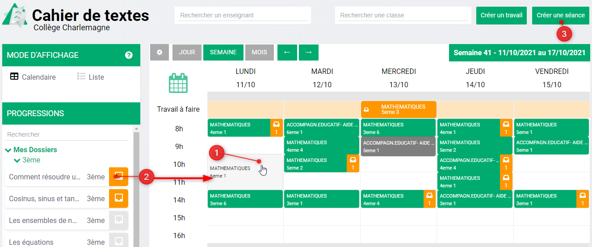
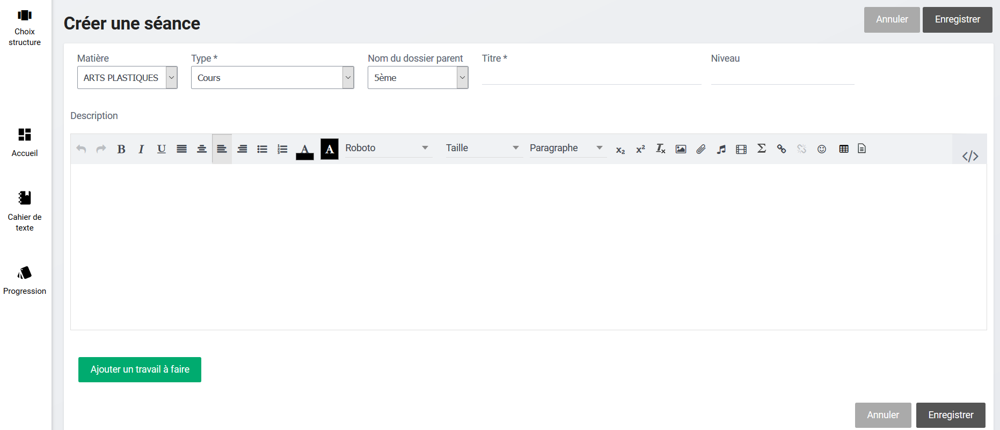
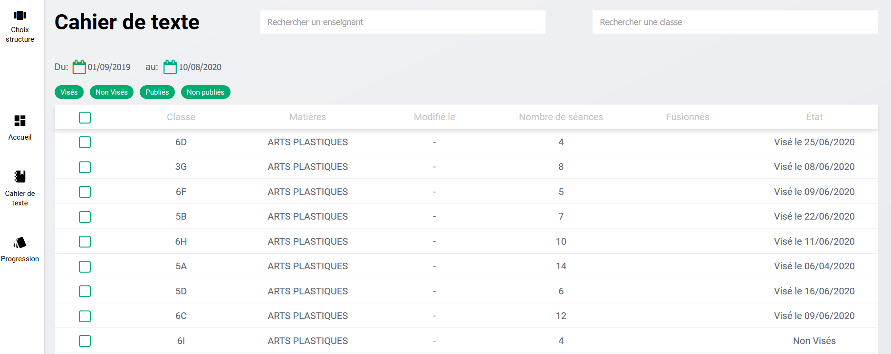
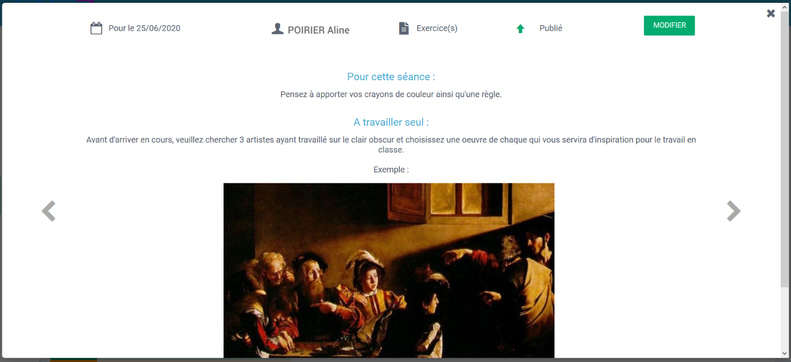
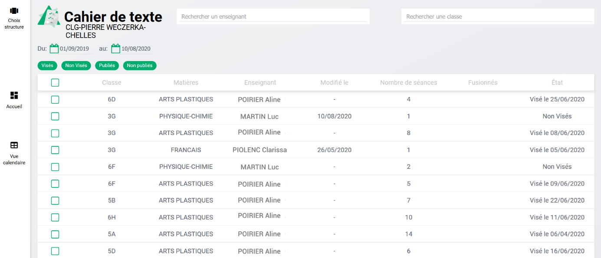
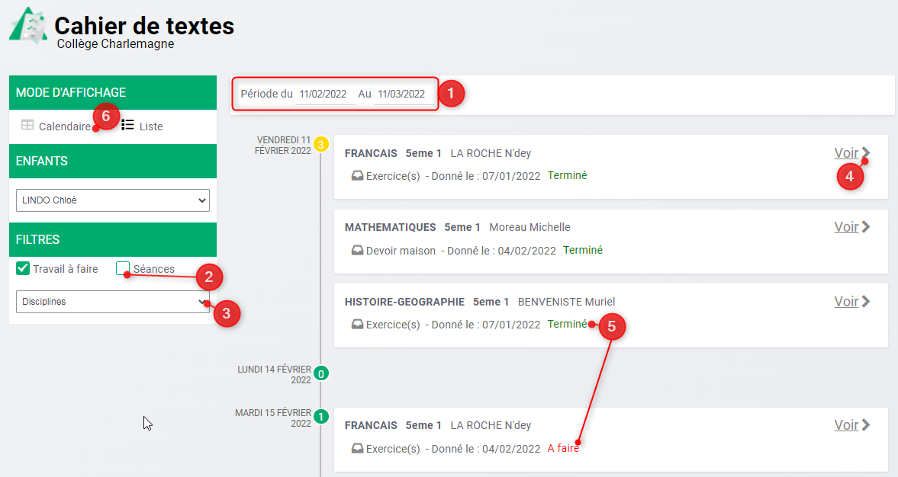
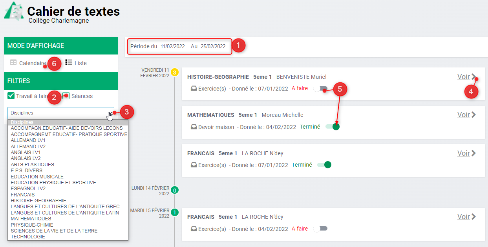

# Cahier de textes

Exit le papier ! Le Cahier de textes permet aux enseignants de partager avec leur réseau les séquences de cours réalisées, ainsi que les devoirs à faire pour les cours suivants.

## Présentation

Le cahier de textes est un module qui permet, selon les profils, d'afficher ou créer des séances, des devoirs. Il permet aux parents et élèves de **suivre les devoirs et séances remplis par les enseignants.** Il permet aux enseignants de **gérer tout leur cahier de textes** : création, modification, création de progressions... Il permet **à la vie scolaire d'accéder aux cahiers de textes pour aider les élèves, et à la direction de viser les cahiers de textes.**

**La vue calendaire** est la vue par défaut du cahier de textes des enseignants. Elle affiche l'emploi du temps de l'enseignant connecté et donne accès aux principales fonctionnalités.

Cette vue calendaire est aussi accessible par la vie scolaire, les élèves et les parents.

**Légende des couleurs :**

- **vert** : une séance a été saisie
- **orange** : un ou plusieurs devoirs ont été saisis pour ce créneau
- **vert et orange** : une séance et un ou plusieurs devoirs ont été saisis sur ce créneau

## Enseignant – renseigner une séance

Pour créer une séance, l’enseignant a plusieurs possibilités :

-   Créer une nouvelle séance sur un créneau existant de l’emploi du temps en cliquant directement sur le créneau concerné dans le calendrier (1).

-   Utiliser une progression déjà crée en glissant-déposant une séance du bloc progression vers un créneau. Si la séance contient un travail à faire, ce dernier sera ajouté (2).

-   Créer une séance sur un nouveau créneau en cliquant sur le bouton « Créer une séance » en haut à droite (3).

Chacune de ces actions ouvre une fenêtre permettant de saisir plusieurs informations.

Si l'ajout de séance a été réalisé en cliquant sur un créneau, la classe et la discipline sont préremplies, sinon il faut renseigner ces 2 informations, pour voir s’afficher les autres données.

Il faut encore compléter :

-   **Un titre** (par défaut, Séance + date du jour).

-   **Une salle** (préremplie avec l'emploi du temps pour la création sur un créneau existant).

-   **Un type de séances** (ces types sont paramétrés par la vie scolaire).

-   **Une date** (préremplie avec la date du créneau choisi ou la date du jour pour la création d’une séance sur un nouveau créneau).

-   **Une description** de la séance que vous pouvez saisir et mettre en forme grâce à l'éditeur de texte présent partout sur l'ENT.

L'option de **publication** est cochée par défaut. Il est possible de la décocher pour saisir des séances et devoirs en avance sans que les autres profils le voient.

Un bouton **"Ajouter un travail à faire"** permet de poursuivre la saisie d'un travail, d'un devoir (cf. paragraphe suivant « donner un devoir »).

**Enseignant – donner un devoir**

Pour donner un travail à faire à vos élèves, vous avez 2 possibilités :

-   Ajouter un travail à faire à une séance, en cliquant sur le bouton **"Ajouter un travail à faire"** d’une séance ouverte.

-   Créer un nouveau travail indépendant d’une séance en cliquant sur le bouton **« Créer un travail »** en haut à droite.

Chacune de ces actions ouvre une fenêtre permettant d’ajouter un travail à faire.

Si l'ajout de travail a été réalisé depuis une séance, la classe et la discipline n’ont pas besoin d’être renseignées, sinon il faut renseigner ces 2 informations, pour voir s’afficher les autres données.

Il faut encore choisir :

-   **L’échéance** du travail à faire : séance (par défaut celle en cours) ou date

-   **Une ou plusieurs classes, groupes** auxquels s’adresse le devoir

-   **Une discipline spécifique** (si l'enseignant est multidisciplinaire)

Il est possible aussi d'ajouter :

-   Un **type de travail** (paramétré par la vie scolaire)

-   Une **durée** estimée

Une fois le travail validé, un **tableau récapitulatif apparaît** en bas de la séance.

## Enseignant – Créer une progression

Il est possible dans ce module d'anticiper son travail de saisie des séances et éventuellement des travaux à faire. Au sein de **Progressions**, l'enseignant peut créer des dossiers et y ranger des séances non publiées, qu'il pourra ensuite glisser-déposer dans la vue calendaire.

**Créer un dossier**

La création d'un dossier se fait depuis le **bouton "Créer un dossier"** dans l'arborescence à gauche.

**Ce dossier correspond à une progression** dans laquelle, il est alors possible de créer des séances en anticipation.

**Créer une séance**

Pour créer une séance, il suffit de **cliquer sur le bouton "Créer une séance" en haut à droite.**

Une fenêtre s'ouvre avec les mêmes champs à remplir que depuis la vue calendaire.

Une fois la séance enregistrée, elle apparaît dans le dossier dans lequel l'utilisateur était positionné. Cette séance se retrouve ensuite dans **le bloc de gauche sur la vue calendaire.**

Ainsi, il est possible de **préremplir des séances dans Progressions pour ensuite les glisser-déposer dans la vue calendaire pour plusieurs classes** et ainsi gagner du temps.

## Enseignant – Gérer les cahiers de textes

**Rechercher le cahier d’un autre enseignant :**

En tant qu'enseignant il est possible d'afficher les cahiers de textes d'autres enseignants et d'autres classes. Il faut pour cela choisir l'enseignant ou la classe dans **les champs de recherche situés en haut de la page.**

**Lister ses cahiers de textes**

Dans la section Cahiers de textes **sont recensés tous les cahiers de textes** saisis par l'enseignant pour toutes ses classes avec des informations sur la dernière modification, le nombre de séances contenues dans le cahier de textes, et l'état s'il a été visé ou non par la direction.

**En cliquant sur les lignes**, le cahier de textes s'ouvre et met à disposition tous les séances et devoirs rattachés à ce cahier de textes.

En cliquant sur une séance ou un travail ses détails s'affichent, **il est alors possible de naviguer de l'un à l'autre à l'aide de flèches de navigation**.

**Retrouver une archive des années précédentes :**

Les archives sont **générées automatiquement tous les étés**. En tant qu'enseignant vous disposez, dans la section **Archives**, de tous vos cahiers de textes des années précédentes au format PDF.

Ils sont **rangés par classe et par matière**.

Si votre nom a changé, vous pourrez trouver vos archives en tapant votre nom de l'année scolaire concernée dans le champ de recherche "Rechercher un enseignant".

## Vie scolaire – Consulter les cahiers de textes

Les équipes de la Vie scolaire et les fonctions Direction disposent de droits différents sur ce module, principalement liés à de la consultation et à des actions de contrôle.

La vue par défaut des équipes de vie scolaire est la vue Liste des cahiers de textes.

Elle propose : **une ligne par enseignant et par classe** : chaque ligne est donc un cahier de textes.

En cliquant sur la ligne le détail s'ouvre et il est alors possible de consulter les séances et devoirs de ce cahier de textes.

Il est aussi possible pour l'équipe de vie scolaire de **consulter la vue calendaire des cahiers de textes**. Cela permet notamment d'accompagner des élèves qui en auraient besoin.

Sur cette vue vide par défaut, il est **nécessaire de sélectionner un enseignant et/ou une classe** pour en afficher le cahier de textes.

## Vie scolaire – Viser un cahier de textes

Si le personnel connecté dispose des droits, il lui est possible de **viser un cahier de textes**. Pour cela, il faut sélectionner le cahier de textes. Un menu apparaît en bas qui permet de sélectionner "Viser".

Une fenêtre s'ouvre pour entrer un commentaire et viser.

## Vie scolaire – Consulter les archives

Les archives sont **générées automatiquement tous les étés**. En tant que personnels de l'établissement, vous disposez de tous les cahiers de textes de l'ensemble des enseignants des années précédentes au format PDF.

Ils sont **rangés par classe, par enseignant et par matière**.

## Parent – Consulter les séances et devoirs

Les parents peuvent accéder au module cahier de textes pour consulter les séances et les devoirs à faire de leur enfant.

Pour un parent rattaché à plusieurs enfants, il faudra préalablement sélectionner l’enfant dont on désire afficher le cahier de textes.

La vue par défaut est **une vue liste qui propose les prochains devoirs à faire** sur les 15 jours à venir.

Il possible d'apporter des **modifications** à cette liste à l'aide de différents filtres :

-   Filtre de **dates modifiables** : il est donc possible de revenir en arrière **(1)**.

-   **Affichage des devoirs à faire uniquement et/ou des séances** **(2)**.

-   Filtre de **discipline** **(3)**.

En cliquant sur un travail à faire ou une séance, celui-ci se déplie pour dévoiler son contenu, mais il est aussi possible de l'afficher en grand en cliquant sur **"Voir" (4)**.

Les parents peuvent voir si les devoirs ont été passés à l’état « Terminé » par leur enfant.

Si la vue liste n'est pas assez lisible, il est possible pour les profils Parents de **basculer sur une vue calendaire (6)**. Cette vue propose l'emploi du temps de l'élève. Avec un jeu de couleur, il est aisé de voir les séances remplies ou les devoirs à effectuer.

## Élèves – Consulter les séances et devoirs

Les élèves peuvent accéder au module cahier de textes pour y consulter les séances et devoirs à faire.

La vue par défaut est **une vue liste qui proposent les prochains devoirs à faire** sur les 15 jours à venir.

Il possible d'apporter des **modifications** à cette liste à l'aide de différents filtres :

-   Filtre de **dates modifiables** : il est donc possible de revenir en arrière **(1)**.

-   **Affichage des devoirs à faire uniquement et/ou des séances** **(2)**.

-   Filtre de **discipline** **(3)**.

En cliquant sur un travail à faire ou une séance, celui-ci se déplie pour dévoiler son contenu, mais il est aussi possible de l'afficher en grand en cliquant sur **"Voir" (4)**.

Un élève **peut noter le travail comment ayant été effectué (5)**.

Si la vue liste n'est pas assez lisible, il est possible de **basculer sur une vue calendaire (6)**.

Cette vue propose l'emploi du temps de l'élève. Avec un jeu de couleur, il est aisé de voir les séances remplies ou les devoirs à effectuer.

## Élèves – Marquer un devoir comme Terminé

Une fois le travail fait, l’élève peut modifier le statut du devoir en cliquant sur le bouton interrupteur à bascule qui se trouve en regard du devoir **à faire**.

Le statut du devoir passe alors à l’état « **Terminé** ».
